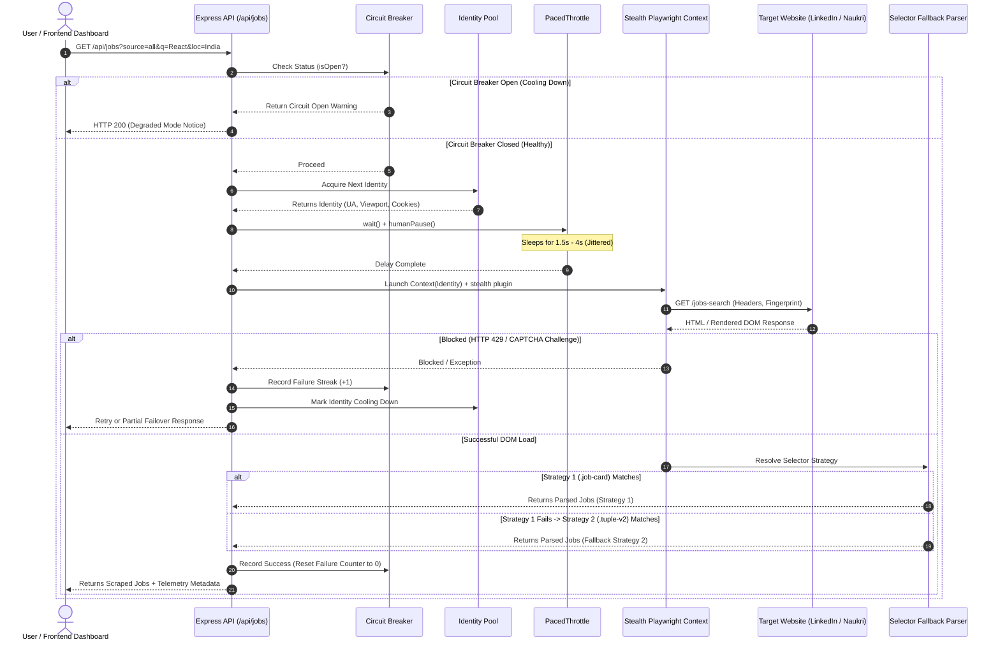

# System Architecture & Technical Flow

This document provides a visual representation of how the **Job Ingestion Engine** operates end-to-end.

---

## 1. High-Level Architecture Diagram

```
┌──────────────────────────────────────────────────────────────────────────────────────────┐
│                                   REACT 19 DASHBOARD                                     │
│   [ Live Discovery Studio ]   [ Telemetry Radar ]   [ Sandbox Drift Simulator ]          │
└───────────────────────────────────────────┬──────────────────────────────────────────────┘
                                            │ HTTP REST Requests (/api/jobs, /api/telemetry)
┌───────────────────────────────────────────▼──────────────────────────────────────────────┐
│                                   EXPRESS API SERVER (:5000)                             │
│   • Request Validation & Sanitization                                                    │
│   • Multi-Source Request Dispatcher                                                      │
└───────────────────────────────────────────┬──────────────────────────────────────────────┘
                                            │ Parallel Dispatch
                 ┌──────────────────────────┼──────────────────────────┐
                 │                          │                          │
┌────────────────▼─────────────┐ ┌──────────▼─────────────┐ ┌──────────▼─────────────┐
│    LinkedIn Guest Adapter    │ │   Naukri Stealth Adapter │ │   Mock Sandbox Adapter   │
│ (Public Unauthenticated API) │ │ (Playwright Headless UI) │ │ (Self-Hosted Target) │
└────────────────┬─────────────┘ └──────────┬─────────────┘ └──────────┬─────────────┘
                 │                          │                          │
                 └──────────────────────────┼──────────────────────────┘
                                            │
┌───────────────────────────────────────────▼──────────────────────────────────────────────┐
│                               CORE RESILIENCE & STEALTH LAYER                             │
│                                                                                          │
│  ┌─────────────────────────────┐  ┌────────────────────────────┐  ┌───────────────────┐  │
│  │       IDENTITY POOL         │  │     PacedThrottle          │  │  CIRCUIT BREAKER  │  │
│  │ • 5 Rotating User-Agents    │  │ • 1.5s-4s Jittered Pause   │  │ • Fail-Fast (3x)  │  │
│  │ • Viewport & Fingerprint    │  │ • Human Scroll Simulation  │  │ • 30s Cooldown    │  │
│  │ • Persisted Session Storage │  │ • Anti-Timing Fingerprint  │  │ • Fail-Safe State │  │
│  └─────────────────────────────┘  └────────────────────────────┘  └───────────────────┘  │
│                                                                                          │
│  ┌────────────────────────────────────────────────────────────────────────────────────┐  │
│  │                         SELECTOR FALLBACK STRATEGY CHAIN                           │  │
│  │ Primary Selectors (.srp-jobtuple) ──(On Empty)──► Secondary (.cust-job-tuple) ──...│  │
│  └────────────────────────────────────────────────────────────────────────────────────┘  │
└──────────────────────────────────────────────────────────────────────────────────────────┘
```

---

## 2. Ingestion & Resilience Sequence Flow (Mermaid Diagram)



---

## 3. How the Scraper Survives Anti-Bot Defenses

| Anti-Bot Defensive Vector | How Our Pipeline Defeats It | Code Reference |
| :--- | :--- | :--- |
| **`navigator.webdriver = true` Detection** | `puppeteer-extra-plugin-stealth` cloaks the automation flag and spoofs Chrome runtime objects. | [`browserManager.ts`](file:///Users/ronakkumarsingh/Desktop/job-scraper-challenge/scraper/src/core/browserManager.ts) |
| **Fixed Interval Bot Timing Analysis** | `PacedThrottle` introduces non-deterministic random jitter (1.5s–4.0s) between actions. | [`rateLimiter.ts`](file:///Users/ronakkumarsingh/Desktop/job-scraper-challenge/scraper/src/core/rateLimiter.ts) |
| **Per-User Rate Limiting & Gating** | `IdentityPool` rotates 5 unique fingerprints (User-Agents, viewports, locales, cookie jars). | [`browserManager.ts`](file:///Users/ronakkumarsingh/Desktop/job-scraper-challenge/scraper/src/core/browserManager.ts) |
| **Markup Drift (CSS Class Renaming)** | `resolveSelectorStrategy` tries backup selectors sequentially before throwing an error. | [`resilience.ts`](file:///Users/ronakkumarsingh/Desktop/job-scraper-challenge/scraper/src/core/resilience.ts) |
| **IP Ban Protection Mid-Run** | `CircuitBreaker` trips after 3 failures and enforces a 30s pause instead of hammering the target. | [`resilience.ts`](file:///Users/ronakkumarsingh/Desktop/job-scraper-challenge/scraper/src/core/resilience.ts) |
